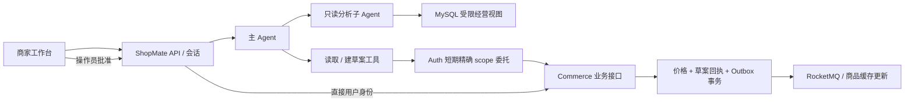

# ShopMate

连接 CityBuddy 交易后端的商家经营 Agent。围绕两件事工作：从已支付订单回答经营问题，以及把调价建议变成可核对、由操作员批准的业务草案。

工作台提供经营概览、商品查询、对话分析和审批历史。买家客服仍使用 CityBuddy 原有入口，ShopMate 是独立的商家入口。

## 工作流程

- **分析经营变化**：主 Agent 读取经营摘要、组织追问，复杂计算委派给只读分析子 Agent。按付款成功时间和历史成交金额统计，支持跨期、商品拆分及多轮修订。
- **提出价格调整**：最多三个同币种普通商品组成一份草案，展示旧价、目标价和商品版本。关联任何秒杀活动的商品不进入此流程。
- **操作员批准**：模型没有执行调价的工具。批准按钮携带登录操作员身份，由 Java 锁定整批商品、复核版本与业务条件，并原子提交价格、草案结果和商品事件。冲突整批拒绝，重复批准返回已有结果。
- **恢复与预算**：会话、草案引用和结果持久化；刷新后重新登录可查看历史。主、分析子 Agent 共享每轮调用次数及截止时间；中断回合保留已产生的业务结果，后续可查，不从中间 token 续跑。



交易与授权边界由 [CityBuddy](https://github.com/ChanTso/citybuddy) 承担，Python 不重复实现价格事务。分析账号仅获三个经营视图的 SELECT 权限，并限制查询时间、结果行数和字节数；模型不接触数据库或服务凭证。

## 本地运行

需要同级 CityBuddy 仓库、Java 21、Python 3.11+、Node.js 24、uv、Docker Compose。CityBuddy 需包含商家接口与视图迁移（PR #149）。

```sh
cd ../citybuddy
make init-local setup-java setup-python
./mvnw --batch-mode --no-transfer-progress -pl auth-service,commerce-service -am package

cd ../shopmate
uv sync --frozen
python3 scripts/local_runtime.py up
uv run uvicorn shopmate.app:create_app --factory --host 127.0.0.1 --port 8101
```

另一个终端启动前端：

```sh
npm --prefix web ci
npm --prefix web run build
npm --prefix web run start
```

打开 `http://127.0.0.1:3100`。本地登录账号为 `shopmate-fixture-operator`，生成的密码在 `.run/operator_password`。本地配置、私钥和数据库凭证仅保存在忽略的 `.run/` 中。

启动脚本复用 CityBuddy 的 Compose、迁移和 SQL 夹具，使用独立的 `shopmate` Compose project 及数据卷，不重置旧买家演示库。Auth/Commerce 分别使用 9081/9082，ShopMate API 使用 8101，前端使用 3100。`python3 scripts/local_runtime.py stop` 停止本项目 Java 与数据服务并保留数据卷；API 与前端在其终端中停止。

## 模型与数据配置

模型代理配置沿用同级 `citybuddy/.env` 中的 `CLIPROXY_BASE_URL` 和 `CLIPROXY_API_KEY`。由运行中的 API 读取，不复制到源代码、浏览器或执行记录。默认主模型和分析模型均为 `gpt-5.6-terra`；模型名、业务服务地址与每轮预算通过 `.run/settings.json` 配置，也可用 `SHOPMATE_CONFIG` 指向另一份本地配置。

实际网络协议为 Chat Completions，通过进程内适配对接 Merchant 的 Messages 循环。主模型流式返回工具参数，收齐后执行并回传；分析子循环使用同一客户端和共享预算。缓存用量只显示代理实际返回的数据，未提供时标为未知，不宣称专属协议的提前派发或缓存收益。

本地夹具固定对账截止时间 `2026-09-05T00:00:00Z`，包含七款商品、42 个完整交易日、历史价格和多种付款状态。成交额采用退款前已支付口径，按 UTC 左闭右开窗口统计，CNY/USD 分别计算。这是可复现的演示数据。

## 检查与业务验收

```sh
uv run ruff check src tests scripts integration_tests
uv run ruff format --check src tests scripts integration_tests
uv run pytest --import-mode=importlib tests \
  vendor/commerce-agents/commerce-common/tests \
  vendor/commerce-agents/merchant-agent/core/tests \
  vendor/commerce-agents/merchant-agent/runtime-messages-api/tests
npm --prefix web run typecheck
npm --prefix web test
npm --prefix web run build
```

独立本地环境启动后，真实数据库与 Java 边界检查另行执行：

```sh
uv run pytest integration_tests -q
```

该检查会修改保留的演示商品和草案。进入下一轮业务任务前，先结束其他任务写入并保存结果，再执行 `python3 scripts/reset_fixture.py`。脚本确认商品事件已发布和消费后，复用 CityBuddy 的 SQL 造数，不清整库或消息队列。

[业务任务约定](evals/README.md) 分开维护 12 个开发任务与 30 个正式业务场景。正式场景每个重复三次，通过真实模型和实际业务接口执行；权限与事务边界单独验证。任务定义不代表已通过，最终业务结论以执行记录、参考 SQL 和数据库终态为准。
