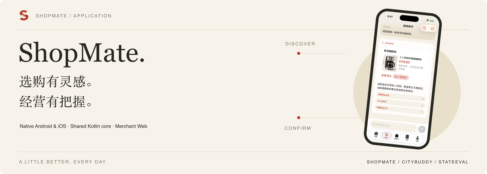
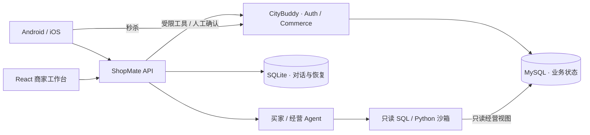

[](https://chantso.github.io/shopmate/)

# ShopMate

[](https://github.com/ChanTso/shopmate/actions/workflows/ci.yml)

**原生购物客户端 × 经营 Agent，让选择、确认与执行成为连续的体验。**

**[浏览产品官网 ↗](https://chantso.github.io/shopmate/)** · [Android](android/README.md) · [iOS](ios/README.md) · [本地运行](docs/RUNTIME.md#本地运行) · [业务验收](evals/records/retail-v2-20260907/README.md)

面向同一零售品牌的 Android / iOS 买家 App 与 React 商家工作台。买家说出需求、比较商品、确认交易；运营人员从经营数据出发，准备方案、核对变更并批准执行。[CityBuddy](https://github.com/ChanTso/citybuddy) 提供实际交易与身份后端。

## 一间商店，两种视角

| 买家 · Android / iOS | 商家 · React Web |
|---|---|
| 商品与规格、比较推荐、购物规划 | 经营趋势、库存预警、订单与售后 |
| 商品上下文对话、流式卡片、可编辑偏好 | 只读 SQL 分析、独立 Python 计算 |
| 购物车、报价确认、订单、模拟支付退款 | 商品维护、调价、补货、促销与营销草案 |
| 秒杀预约、状态查询与原操作恢复 | 差异预览、操作员批准、执行回执 |

官网展示真实客户端画面与交互演示；完整业务由本地服务运行。

## 值得深入的四个设计

- **原生界面，共享规则。** Android 使用 Jetpack Compose，iOS 使用 SwiftUI；KMP 共享 SSE 解帧、消息归并、报价与恢复规则。导航、网络取消、安全存储和生命周期保留平台实现。
- **流式阅读与异步状态。** 文字和商品卡片增量到达，阅读历史时保持位置，回到末尾再跟随。分页绑定已提交查询，迟到详情不能覆盖新选择；SwiftUI 以不可变消息段建立相等性边界，保留未变化卡片。
- **原操作恢复。** 写入前持久化请求 key、原参数与确认报价。响应丢失后核对原回执，按原意图恢复；生成任务、普通购物与审批独立推进，业务终态由 Java 事务决定。
- **能分析，也有执行边界。** 经营 Agent 将复杂分析交给只读 SQL 子 Agent，完整且有界的数据可交独立 Python 容器计算。Skills 按需加载，旧工具结果裁剪，记忆可改删；各类模型调用共用预算。结账、付款、退款确认及经营变更批准均由用户操作。

## 系统边界



ShopMate 当前为单实例宿主，SQLite 使用 WAL 保存对话、意图和偏好；MySQL 保存身份、商品、订单和交易回执。两者职责与运行约束见[工程指南](docs/RUNTIME.md#身份对话与持久状态)。

## 验证与结果

原生测试覆盖流式阅读、取消、分页与详情竞态、跨页面状态和原请求恢复；业务集成测试通过真实接口与 SQL 核对交易结果。

[零售验收](evals/records/retail-v2-20260907/README.md)包含 **18 个已知场景、30 次真实模型尝试：24 次通过，3 次业务失败，3 次提供者故障**。购物付款退款、促销成交与经营分析等核对实际回答和数据库状态，报告保留失败、工作负载与完整源码版本。

[StateEval](https://github.com/ChanTso/state-eval)单独检验授权边界；业务完成、权限正确与模型回答质量分别判定。

## 本地运行

需要同级 CityBuddy 仓库、Java 21、Python 3.11+、Node.js 24、uv 与 Docker Compose。完成[首次后端准备](docs/RUNTIME.md#本地运行)后：

```sh
uv sync --frozen
python3 scripts/local_runtime.py up
npm --prefix web ci
npm --prefix web run build
uv run uvicorn shopmate.app:create_app --factory --host 127.0.0.1 --port 8101
```

商家工作台：**http://127.0.0.1:8101/**。买家客户端按 [Android](android/README.md) / [iOS](ios/README.md) 说明构建；模型配置、演示账号、数据重置及检查命令统一见[运行指南](docs/RUNTIME.md)。

## 工程入口

| 目录 | 内容 |
|---|---|
| [`android/`](android/) · [`ios/`](ios/) · [`shared/`](shared/) | 原生客户端与 KMP 业务核心 |
| [`web/`](web/) · [`src/shopmate/`](src/shopmate/) | React 工作台与 Agent 宿主 |
| [`integration_tests/`](integration_tests/) · [`evals/`](evals/) | 业务边界测试与真实模型验收 |
| [`site/`](site/) | 独立构建的 GitHub Pages 产品官网 |

复用 [commerce-agents](vendor/commerce-agents/README.md) 的零售核心与 Messages 运行时，扩展原生客户端、业务工具、身份、持久状态与实际交易接入。保留上游 [Apache-2.0 许可](vendor/commerce-agents/LICENSE)及[图片来源](web/public/products/IMAGE-CREDITS.md)；封面使用[官网中相同的原生演示画面](site/README.md)。
