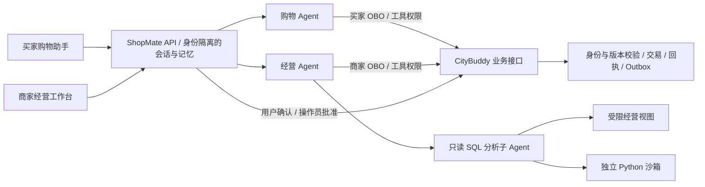

# ShopMate

远山户外官方商店的零售应用与 Agent 工作台。CityBuddy 提供同一家店的交易与身份后端；ShopMate 负责买家与操作员的应用入口、Agent 和对话。一个商品目录、一支运营团队、多位顾客，不包含多商户入驻。商家端支持经营分析、商品与库存、订单问题和审批执行；买家端支持推荐与比较、购物车、本人订单及由用户确认的结账、模拟付款和退款申请。

项目复用 [commerce-agents](vendor/commerce-agents/README.md) 的商家与购物核心、Messages 运行时和零售页面组件；业务工具、身份、持久会话及实际写入接入 CityBuddy。原 [Apache-2.0 许可证](vendor/commerce-agents/LICENSE)、版权声明和[图片来源](web/public/products/IMAGE-CREDITS.md)保留。

## 当前能力

- **经营分析**：主 Agent 组织查询与追问，复杂计算交给分析子 Agent；它通过受限 SQL 取数，也可在独立 Python 容器内计算完整查询结果。成交额来自成功付款的历史订单，流量和广告归因有独立的观察期间与来源；缺失数据不填零。
- **经营首页与订单**：六项指标、四项日趋势和三类待办使用同一报告口径；近期订单读取当前全店标准单与秒杀单，不受历史报告截止限制。按 SKU 子单展示成交时的金额，订单、付款、退款和履约状态分别保留。
- **商品与运营**：服务端分页浏览商品系列和单品，详情展开真实 SKU、规格、当前价格、库存、内容和成本观察；库存预警及订单问题提供对应分析入口。
- **五类草案**：支持 `LISTING_UPDATE`、`PRICE_UPDATE`、`INVENTORY_ACTION`、`PROMOTION`、`CAMPAIGN`。涉及商品的操作展开后至多 25 个 SKU；卡片分别显示金额、数量、开关和文字差异。
- **操作员审批**：模型可读取、建案和取消未执行方案，不能批准。批准按钮使用登录操作员的直接身份；Java 核对快照、版本和业务条件，在同一事务内保存实际变更、草案回执及适用的商品 Outbox。冲突整批拒绝，重复批准返回原结果。
- **恢复与停止**：会话和草案引用保存在 SQLite，业务终态以 Java 为准。刷新后重新登录可恢复记录；“停止生成”中断当前请求，不撤销已保存的草案或已执行的变更。审批结果独立保存在业务回执中，模型生成不阻止普通购物与操作员审批；真实版本冲突和未知写入仍需核对。

促销批准会立即修改商品实际售价，**经营窗口结束后不会自动恢复价格**。开始前批准返回 `promotion_not_started` 并保留待批准状态；过期未执行方案被拒绝。营销活动创建或更新的是本站计划、受众、文案和预算，不代表向外部广告平台投放，也不改写既有支出或收入观察。



商家入口为 `/`，买家入口为 `/buyer`；买家登录、人工确认、停止恢复与记忆管理见[买家使用说明](docs/BUYER.md)。CityBuddy 商城的购物助手链接已统一指向 ShopMate；旧客服入口与重复模型循环已撤下，Java 的授权、退款确认及回执机制继续复用。两个角色都可调用有来源的网页搜索；经营分析可调用独立 Python 沙箱。[完整零售验收](evals/records/retail-v1-20260907/README.md)记录真实业务任务、页面操作、记忆、并发与中断恢复；业务成绩和边界检查分别报告。

## 身份、对话与持久状态

普通购物和经营接口只要求对应角色的 `Authorization: Bearer`，不要求聊天 ID。服务端按主体和角色保存内部授权绑定，再按 Java 端点交换精确 scope 的 OBO；部分 UI 购物操作也走此受限代理。模型没有付款、退款确认或操作员批准工具。

聊天通过 `POST /api/{buyer|merchant}/conversations` 创建，列表和恢复分别使用 `GET /conversations`、`GET /conversations/{id}`，流式调用为 `POST /conversations/{id}/chat`。原 `/session`、`/sessions`、`/chat` 在旧 Web 过渡期间保留。命令与结账/退款记录按主体读取，旧操作保留原 key、请求体和授权绑定，换聊天不会变成新的业务意图。

当前为单进程、单实例 Python 服务；SQLite 存储对话、意图、恢复记录和记忆，使用 WAL，必须保存在持久目录，不能随容器重建丢弃。`state_path` 可配置，夹具重置先用 SQLite backup 保存原库；Java/MySQL 是交易权威来源。不得直接以多个 Uvicorn workers 扩容。默认最多 8 个活跃聊天任务、每用户 2 个，同一对话串行；超额返回 429，普通业务请求不占模型任务名额。这些是任务上限配置，不是容量测量。

## 本地运行

需要同级 [CityBuddy](https://github.com/ChanTso/citybuddy) 仓库、Java 21、Python 3.11+、Node.js 24、uv 和 Docker Compose。CityBuddy 至少包含 [PR #159](https://github.com/ChanTso/citybuddy/pull/159)（`2eb42634f082c0ddf93639f902db38009381d337`），提供零售/营销迁移、商家操作、全店近期订单读取和 FAQ 发布 CLI。

首次准备 Java 服务：

```sh
cd ../citybuddy
make init-local setup-java setup-python
./mvnw --batch-mode --no-transfer-progress -pl auth-service,commerce-service -am package

cd ../shopmate
uv sync --frozen
python3 scripts/local_runtime.py up
uv run uvicorn shopmate.app:create_app --factory --host 127.0.0.1 --port 8101
```

`up` 要求 ShopMate API 已停止；首次初始化统一零售夹具，已有该版本数据时保留当前业务变更。另开终端启动前端：

```sh
npm --prefix web ci
npm --prefix web run build
npm --prefix web run start
```

访问 `http://127.0.0.1:3100`。登录账号为 `shopmate-fixture-operator`，生成的密码保存在忽略的 `.run/operator_password`，不写入文档或执行记录。Bearer 只保留在页面内存，刷新需重新登录。

启动脚本使用独立的 `shopmate` Compose project 和数据卷，不重置 CityBuddy 默认演示库。Auth/Commerce 使用 9081/9082，ShopMate API 使用 8101，前端使用 3100。停止 API 和前端各自的终端后，运行 `python3 scripts/local_runtime.py stop` 停止本项目 Java 与数据服务、保留卷。

## 模型、预算与时间

模型代理凭证继续来自同级 `citybuddy/.env` 的 `CLIPROXY_BASE_URL` 和 `CLIPROXY_API_KEY`。默认主模型与分析模型均为 `gpt-5.6-terra`，经 Chat Completions 适配对接 Messages 循环。运行参数位于 `.run/settings.json`，也可通过 `SHOPMATE_CONFIG` 指定配置文件；凭证不传入浏览器或模型工具参数。

每回合主、分析子 Agent 共用默认 16 次模型调用和 300 秒截止；主循环最多 12 个工具轮。分析账号仅有六个经营视图的 SELECT，默认查询上限 2 秒、200 行及 16,000 字节。Python 只接收这些视图的完整、有界查询结果；截断表在执行前拒绝。缓存用量仅展示代理实际报告的字段，未知量不推断成命中率或费用收益。主、分析、记忆和搜索请求共用模型调用预算；实际 Responses 搜索用量与 Chat 用量合计一次。默认每聊天回合至多 3 次搜索和 3 次 Python 尝试，次数与回合时间限制不是硬 token 或费用上限。

网页搜索通过独立的 Responses 请求接入现有普通工具接口，返回外部摘要、实际引用和服务提供的查阅来源。来源卡将引用与查阅列表分开；没有元数据时明确提示。网页内容不作为本站商品、订单、政策或权限真相。当前代理不支持原生 Messages server tools，本部署没有启用原生 server search、code execution 或原生提前派发；搜索与 Python 能力由宿主实际执行。字段依据见 [Responses 搜索文档](https://developers.openai.com/api/docs/guides/tools-web-search)。

`local_runtime.py up` 从 `infra/analysis-sandbox/` 专用目录构建 `shopmate-analysis:1`。每次 Python 调用创建独立容器：非 root、无网络、只读根目录、不挂载宿主或项目文件，固定 Python/pandas/numpy，1 CPU / 512 MiB / 64 PID / 32 MiB 临时目录。单次执行窗口至多 20 秒（含排队），结束清理另有 10 秒限时；合计输出至多 64 KiB，宿主同时运行至多两个；查询和排队也受任务截止约束。停止生成、任务超时或正常关闭会终止对应容器；若 Docker 失联导致无法核实清理，会报告错误并拒绝后续沙箱执行，不把它当成成功。宿主被强制杀死后的遗留容器不属于该保证，可按 `shopmate.analysis=true` 标签检查。容器约束说明见 [Docker 文档](https://docs.docker.com/engine/containers/run/)。

当前演示数据为 `shopmate-retail-v1`：**87 个目录根、104 个可交易 SKU、90 个完整 Shanghai 日、CNY**。这是从 vendored 零售样例和确定性造数构成的演示数据，不是实际经营记录。报告截止固定为 `2026-09-05T00:00:00+08:00`；模型的操作时钟是每轮真实 Shanghai 时间。相对报表期间使用报告截止，促销的“今天/明天”使用真实操作日期。详情见[零售夹具与重置说明](docs/retail-fixture.md)。

## 使用工作台

登录后可依次体验以下流程；这是当前能力的操作说明，不代表一次新的模型验收结果：

1. 在商品页翻页、筛选状态和内容质量，打开商品系列并核对各 SKU、成本和报告期间销量。
2. 问“当前报告期间的成交、流量和转化，相比上一期间有什么变化？请列出依据。”继续追问贡献商品或营销计划的同期 ROAS。
3. 从库存提醒、商品详情或营销页提出方案，在草案卡片核对完整差异。仅提出方案不会立即修改商品。
4. 点击批准或取消，再从历史和业务页面读回状态。促销先核对真实允许批准窗口及到期不自动恢复的后果。
5. 流式运行时点击“停止生成”，随后刷新会话核对保存的状态。不要依据未完成的回复判断写入是否发生。

## 检查与历史记录

以下命令运行代码检查，不调用真实模型：

```sh
uv run ruff check src tests scripts integration_tests
uv run ruff format --check src tests scripts integration_tests
uv run pytest --import-mode=importlib tests \
  vendor/commerce-agents/commerce-common/tests \
  vendor/commerce-agents/merchant-agent/core/tests \
  vendor/commerce-agents/merchant-agent/runtime-messages-api/tests \
  vendor/commerce-agents/shopping-agent/core/tests \
  vendor/commerce-agents/shopping-agent/runtime-messages-api/tests
npm --prefix web run typecheck
npm --prefix web test
npm --prefix web run build
```

真实 Java/数据库边界检查使用 `uv run pytest integration_tests -q`，会修改保留的演示业务数据，应与其他任务串行运行。每次完整运行前，先停止 API 和全部写入、保存所需记录，按[手工重置流程](docs/retail-fixture.md#手工重置)恢复夹具后重新启动 API；正常 `up` 会保留已批准的变更，不能代替重置。直接重复写入套件可能触发无变更草案拒绝，或继续改变测试商品的价格和库存。

[最终零售业务验收](evals/records/retail-v2-20260907/README.md)覆盖18个已知场景、按登记共30次：**24次通过、3次业务失败、3次提供者故障**，对应冻结版本 `4020ff93f4797e2ae3142e8a4123442d3d8693b7`。购物付款退款、商品维护、补货、促销成交、营销审批、搜索与SQL/Python分析均核对实际回复和数据库终态；日期表达和遗漏回答的失败保留。61个聊天回合的结束等待p50为30.54秒、p95为87.08秒，包含失败，不代表并发容量。[前一轮54次与边界验证](evals/records/retail-v1-20260907/README.md)单列，不混合版本或分母；操作仍须由用户确认并经Java事务校验。

[评测索引](evals/records/README.md)保留旧七商品/42 日 UTC 版本的 **78/90** 与定向 **21/24**；它们不描述当前零售数据或本次完整批。[历史浏览器演示、截图和 SQL](docs/demo-20260906/README.md)仍对应旧版，当前双端页面、记忆与恢复记录见新版验收。
