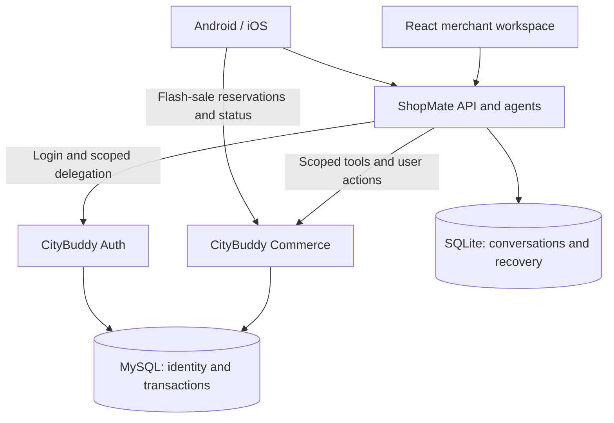
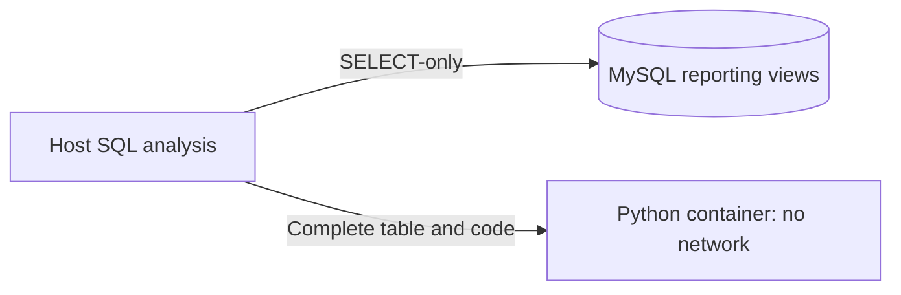

<p align="center">
  <a href="https://chantso.github.io/shopmate/">
    
  </a>
</p>

<h1 align="center">ShopMate</h1>

<p align="center">
  <a href="https://chantso.github.io/shopmate/"><strong>Explore the product ↗</strong></a>
</p>

<p align="center">Native shopping apps and commerce agents. From choosing to confirming to acting.</p>

<p align="center">
  <a href="https://github.com/ChanTso/shopmate/actions/workflows/ci.yml"></a>
  <a href="https://deepwiki.com/ChanTso/shopmate"></a>
</p>

**English** · [简体中文](README.zh-CN.md)

[Android](android/README.md) · [iOS](ios/README.md) · [Run locally](docs/RUNTIME.md#run-locally) · [Retail evaluation](evals/records/retail-v2-20260907/README.md) · [Contributing](CONTRIBUTING.md)

Android / iOS buyer apps and a React merchant workspace for one retail brand. Shoppers describe what they need, compare products, and confirm transactions. Operators turn business data into proposals, review changes, and approve execution. [CityBuddy](https://github.com/ChanTso/citybuddy) provides the transaction and identity backend.

## One store, two perspectives

| Buyer · Android / iOS | Merchant · React Web |
|---|---|
| Products and specifications, comparisons, shopping plans | Sales trends, inventory alerts, orders and after-sales |
| Product-aware conversations, streaming cards, editable preferences | Read-only SQL analysis and isolated Python computation |
| Cart, quote confirmation, orders, simulated payments and refunds | Product updates, pricing, restocking, promotions and marketing drafts |
| Flash-sale reservations, status lookup, original-operation recovery | Change previews, operator approval, execution receipts |

The product site presents native application footage and interaction demonstrations. The full business flows run with local services.

## Four designs to explore

- **Native interfaces, shared rules.** Android uses Jetpack Compose; iOS uses SwiftUI. KMP shares SSE decoding, message reduction, quote handling, and recovery rules. Navigation, network cancellation, secure storage, and lifecycle handling stay with each platform.
- **Streaming reads and asynchronous state.** Text and product cards arrive incrementally. Reading history preserves scroll position; returning to the end resumes following. Pagination belongs to the submitted query, and late product details cannot replace a newer selection. SwiftUI uses immutable message segments as equality boundaries to retain unchanged cards.
- **Recover the original operation.** Request keys, original arguments, and confirmed quotes are persisted before writes. If a response is lost, recovery checks the original receipt and resumes the same intent. Generation, ordinary shopping, and approvals proceed independently; Java transactions determine the final business state.
- **Analysis with explicit execution boundaries.** The merchant agent delegates complex queries to a read-only SQL sub-agent; complete, bounded datasets can pass to an isolated Python container. Skills load on demand, old tool results are trimmed, memory is editable, and model calls share a budget. Checkout, payment, refund confirmation, and approval of merchant changes remain user actions.

## System boundaries



Merchant analysis uses a separate data path. The host queries reporting views with a read-only account, then passes complete, bounded tables to the network-isolated Python container.



The Python container has no database connection or credentials. Identity, conversation ownership, and business authorization remain enforced by their owning services.

ShopMate currently runs as a single-instance host. SQLite with WAL stores conversations, intents, and preferences; MySQL stores identities, products, orders, and transaction receipts. See the [runtime guide](docs/RUNTIME.md#identity-conversations-and-persistent-state) for ownership and deployment constraints.

## Validation and results

Native tests cover streaming reads, cancellation, pagination and detail races, state across screens, and original-request recovery. Business integration tests verify transactions through real APIs and SQL.

The [retail evaluation](evals/records/retail-v2-20260907/README.md) records **18 known scenarios and 30 real-model attempts: 24 passes, 3 business failures, and 3 provider failures**. Shopping, payment, refunds, promotional purchases, and merchant analysis are checked against actual responses and database state. The report retains failures, workload definitions, and full source revisions.

[StateEval](https://github.com/ChanTso/state-eval) examines authorization separately. Business completion, permission correctness, and response quality are distinct judgments.

<a id="本地运行"></a>

## Run locally

Prerequisites: a sibling CityBuddy checkout, Java 21, Python 3.11+, Node.js 24, uv, and Docker Compose. Complete the [initial backend setup](docs/RUNTIME.md#run-locally), then run:

```sh
uv sync --frozen
python3 scripts/local_runtime.py up
npm --prefix web ci
npm --prefix web run build
uv run uvicorn shopmate.app:create_app --factory --host 127.0.0.1 --port 8101
```

Open the merchant workspace at **http://127.0.0.1:8101/**. Build the buyer apps using the [Android](android/README.md) or [iOS](ios/README.md) guide. Model configuration, demo accounts, data reset, and checks are documented in the [runtime guide](docs/RUNTIME.md).

## Explore the code

| Directory | Contents |
|---|---|
| [`android/`](android/) · [`ios/`](ios/) · [`shared/`](shared/) | Native clients and the KMP business core |
| [`web/`](web/) · [`src/shopmate/`](src/shopmate/) | React workspace and agent host |
| [`integration_tests/`](integration_tests/) · [`evals/`](evals/) | Business-boundary tests and real-model evaluations |
| [`site/`](site/) | Independently built GitHub Pages product site |

ShopMate reuses the retail cores and Messages runtime from [commerce-agents](vendor/commerce-agents/README.md), adding native clients, business tools, identity, persistent state, and transaction integration. Upstream [Apache-2.0 licensing](vendor/commerce-agents/LICENSE) and [image credits](web/public/products/IMAGE-CREDITS.md) are preserved. The [product site notes](site/README.md) describe how its native footage and interaction demonstrations were made.

[Contributing](CONTRIBUTING.md) · [Apache-2.0 license](LICENSE)
