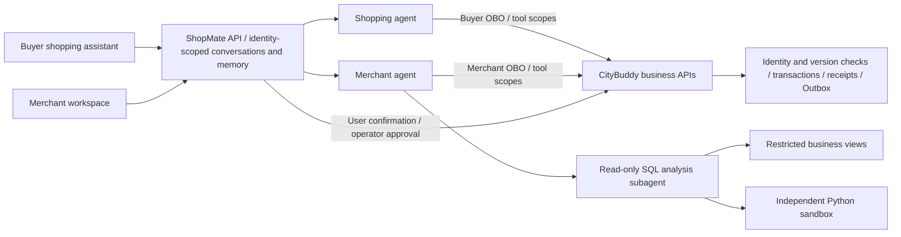

# Runtime and engineering guide

[Back to the project overview](../README.md). Run each command from the repository root indicated below.

An application and agent workspace for one retail brand's official store. CityBuddy provides the store's transaction and identity backend; ShopMate provides buyer and operator interfaces, agents, and conversations. The scope is one catalog, one operations team, and multiple customers, without multi-merchant onboarding. Merchants can analyze performance, manage products and stock, investigate order issues, and approve changes. Buyers can get recommendations and comparisons, manage their cart and own orders, and explicitly confirm checkout, simulated payment, and refund requests.

The project reuses [commerce-agents](../vendor/commerce-agents/README.md)' merchant and shopping cores, Messages runtime, and retail UI components. Business tools, identity, persistent conversations, and actual writes connect to CityBuddy. The original [Apache-2.0 license](../vendor/commerce-agents/LICENSE), copyright notices, and [image credits](../web/public/products/IMAGE-CREDITS.md) are preserved.

## Product showcase

The [static product site](../site/README.md) lives in `site/`, separately from the merchant React workspace in `web/`. It uses real client images and scrolling interactions without requiring an online model or transaction service; the complete business demo runs locally. Android and SwiftUI buyer clients share a KMP protocol and recovery core. See `android/README.md` and `ios/README.md` for their build instructions.

## Current capabilities

- **Business analysis:** the main agent organizes queries and follow-ups; an analysis subagent handles complex calculations through restricted SQL and an independent Python container that receives complete query results. Revenue uses successfully paid historical orders. Traffic and advertising attribution have their own observation periods and sources; missing data is not filled with zero.
- **Merchant overview and orders:** four core metrics, selectable daily trends, and three task categories share the same reporting definitions. Recent orders read current standard and seckill orders across the store, independently of the historical report cutoff. Amounts reflect the original sale at SKU suborder level; order, payment, refund, and fulfillment states remain separate.
- **Products and operations:** server-side pagination covers product families and individual items. Details expose real SKUs, variants, current prices, stock, content, and cost observations; inventory alerts and order issues lead to relevant analysis.
- **Five draft types:** `LISTING_UPDATE`, `PRICE_UPDATE`, `INVENTORY_ACTION`, `PROMOTION`, and `CAMPAIGN`. Product operations expand to at most 25 SKUs. Cards distinguish changes to amounts, quantities, switches, and text.
- **Operator approval:** the model can read, propose, and cancel unexecuted plans, but cannot approve them. Approval uses the signed-in operator's direct identity. Java checks snapshots, versions, and business conditions, then atomically saves the change, draft receipt, and applicable product Outbox events. A conflict rejects the entire batch; repeated approval returns the original result.
- **Recovery and stopping:** SQLite stores conversations and draft references; Java remains authoritative for business outcomes. Refreshing and signing in again restores records. “停止生成” (verbatim UI label: stop generation) interrupts the request without undoing saved drafts or applied changes. Approval results remain in business receipts. Model generation does not block ordinary shopping or operator approval; actual version conflicts and uncertain writes still require verification.

Approving a promotion immediately changes the actual sale price; **the price does not automatically revert when the promotion window ends**. Approval before the window returns `promotion_not_started` and leaves the draft pending; an expired, unexecuted plan is rejected. Campaigns create or update local plans, audiences, copy, and budgets. They do not publish to external advertising platforms or overwrite existing spend or revenue observations.



The merchant entry point is React/Vite Web at `/`; the buyer entry point is the [Kotlin/Compose Android app](../android/README.md). See the [buyer guide](BUYER.md) for sign-in, explicit confirmation, stopping, recovery, and memory management. The old `/buyer` page, support-agent entry point, and duplicate model loop have been retired; Java authorization, refund confirmation, and receipt mechanisms remain in use. Both roles can use web search with sources; business analysis can use an independent Python sandbox. The [complete retail acceptance record](../evals/records/retail-v1-20260907/README.md) covers real tasks, UI interactions, memory, concurrency, and interruption recovery, reporting business outcomes separately from boundary checks.

<a id="身份对话与持久状态"></a>
## Identity, conversations, and persistent state

Ordinary shopping and merchant APIs require the appropriate role's `Authorization: Bearer`, without a chat ID. The server stores internal authorization bindings by subject and role, then exchanges an OBO token with the exact scope required by each Java endpoint; some shopping UI operations use this restricted proxy too. The model has no payment, refund-confirmation, or operator-approval tool.

Create chat through `POST /api/{buyer|merchant}/conversations`, list and restore through `GET /conversations` and `GET /conversations/{id}`, and stream through `POST /conversations/{id}/chat`. The old `/session`, `/sessions`, and `/chat` routes remain for historical protocol compatibility; official clients do not use them. Commands and checkout/refund records are read by subject. Existing operations retain their original key, body, and authorization binding; changing chats does not create a new business intent.

The Python service currently runs as one process and one instance. SQLite with WAL stores conversations, intents, recovery records, and memory in a persistent directory that must survive container replacement. `state_path` is configurable; fixture reset backs up the database through SQLite backup first. Java/MySQL is authoritative for transactions. Do not scale by simply adding Uvicorn workers. Defaults allow at most 8 active chat tasks and 2 per user, with one task per conversation; excess requests receive 429. Ordinary business requests do not consume model-task slots. These are configured limits, not measured capacity.

<a id="本地运行"></a>
## Run locally

Prerequisites are a sibling [CityBuddy](https://github.com/ChanTso/citybuddy) checkout, Java 21, Python 3.11+, Node.js 24, uv, and Docker Compose. CityBuddy must include at least [PR #159](https://github.com/ChanTso/citybuddy/pull/159) (`2eb42634f082c0ddf93639f902db38009381d337`), which supplies retail/campaign migrations, merchant operations, store-wide recent orders, and the FAQ publication CLI.

Initial Java service setup:

```sh
cd ../citybuddy
make init-local setup-java setup-python
./mvnw --batch-mode --no-transfer-progress -pl auth-service,commerce-service -am package

cd ../shopmate
uv sync --frozen
python3 scripts/local_runtime.py up
npm --prefix web ci
npm --prefix web run build
uv run uvicorn shopmate.app:create_app --factory --host 127.0.0.1 --port 8101
```

`up` requires the ShopMate API to be stopped. It initializes the unified retail fixture on first use and preserves business changes when that data version already exists. After the build, Python serves the merchant Web app from `http://127.0.0.1:8101/`; no separate Next/Node service is needed. For Web development, run `npm --prefix web run dev` in another terminal; port 3100 proxies API requests to 8101.

The operator account is `shopmate-fixture-operator`; its locally generated password is in ignored `.run/operator_password`. Bearer tokens stay in page memory, so refreshing requires sign-in again. See [android/README.md](../android/README.md) for Android build and installation; the emulator connects to `http://10.0.2.2:8101`.

The launcher uses the separate `shopmate` Compose project and volumes without resetting CityBuddy's default demo database. Auth/Commerce use 9081/9082; the ShopMate API/Web uses 8101. After stopping the API, `python3 scripts/local_runtime.py stop` stops this project's Java and data services while preserving volumes. Keep the conversation database in `.run` or another persistent directory.

## Models, budgets, and time

Model proxy credentials come from `CLIPROXY_BASE_URL` and `CLIPROXY_API_KEY` in the sibling `citybuddy/.env`. Both main and analysis models default to `gpt-5.6-terra`, using a Chat Completions adapter for the Messages loop. Runtime settings live in `.run/settings.json`, or a file selected by `SHOPMATE_CONFIG`. Credentials do not enter the browser or model tool arguments.

The main and analysis agents share a default 16 model calls and a 300-second deadline per turn; the main loop allows at most 12 tool rounds. The analysis account has SELECT on only six business views, with default query limits of 2 seconds, 200 rows, and 16,000 bytes. Python receives only complete, bounded results from these views; truncated tables are rejected before execution. Cache usage displays only fields actually reported by the proxy; unknown values do not become hit rates or cost savings. Main, analysis, memory, and search requests share the model-call budget; Responses search and Chat usage are counted once. Each chat turn allows at most 3 search and 3 Python attempts by default. Call and time limits are not hard token or monetary limits.

Web search uses a separate Responses request behind the existing ordinary tool interface. It returns external summaries, actual citations, and provider-supplied consulted sources. Source cards distinguish citations from consulted pages and explicitly indicate missing metadata. Web content is not authoritative for this store's products, orders, policies, or permissions. The current proxy does not support native Messages server tools, so this deployment does not enable native server search, code execution, or early dispatch; the host performs search and Python execution. See the [Responses web-search documentation](https://developers.openai.com/api/docs/guides/tools-web-search) for the fields.

`local_runtime.py up` builds `shopmate-analysis:1` from the dedicated `infra/analysis-sandbox/` directory. Each Python call creates a separate non-root container with no network, a read-only root filesystem, no host/project mounts, fixed Python/pandas/numpy, and limits of 1 CPU / 512 MiB / 64 PID / 32 MiB temporary storage. The execution window is at most 20 seconds including queueing, with another 10 seconds for cleanup, at most 64 KiB combined output, and at most two concurrent executions. Queries and queueing also respect the task deadline. Stopping generation, task expiry, or normal shutdown terminates the corresponding container. If Docker is unreachable and cleanup cannot be verified, the host reports an error and rejects further sandbox work. Containers left after the host is forcibly killed are outside that guarantee and can be inspected by the `shopmate.analysis=true` label. See [Docker's container documentation](https://docs.docker.com/engine/containers/run/) for these constraints.

The demo fixture is `shopmate-retail-v1`: **87 catalog roots, 104 tradable SKUs, 90 complete Shanghai days, CNY**. It combines vendored retail samples with deterministic synthetic data, not real business records. The reporting cutoff is fixed at `2026-09-05T00:00:00+08:00`; each model turn receives the actual Shanghai operation time. Relative reporting periods use the cutoff; promotion dates such as today or tomorrow use the actual operation date. See the [retail fixture and reset guide](retail-fixture.md).

## Use the workspace

The following walkthrough describes capabilities, not a new model-evaluation result. The sample Chinese prompt is retained verbatim.

1. Page through products, filter by status and content quality, and open a family to inspect SKUs, cost, and sales during the report period.
2. Ask “当前报告期间的成交、流量和转化，相比上一期间有什么变化？请列出依据。” Follow up on contributing products or campaign ROAS over the same period.
3. Propose a change from a stock alert, product detail, or campaign page, then review the complete differences in its draft card. Proposing alone does not modify products.
4. Approve or cancel, then read the outcome from history and the business pages. For promotions, review the actual approval window and the lack of automatic price restoration at expiry.
5. Stop generation during a stream, then refresh the conversation to inspect saved state. An unfinished answer does not establish whether a write occurred.

<a id="检查与历史记录"></a>
## Checks and historical records

These code checks do not call a real model:

```sh
uv run ruff check src tests scripts integration_tests
uv run ruff format --check src tests scripts integration_tests
uv run pytest --import-mode=importlib tests \
  vendor/commerce-agents/commerce-common/tests \
  vendor/commerce-agents/merchant-agent/core/tests \
  vendor/commerce-agents/merchant-agent/runtime-messages-api/tests \
  vendor/commerce-agents/shopping-agent/core/tests \
  vendor/commerce-agents/shopping-agent/runtime-messages-api/tests
npm --prefix web run typecheck
npm --prefix web test
npm --prefix web run build
```

Real Java/database boundary checks use `uv run pytest integration_tests -q`, modify retained demo business data, and must run serially with other work. Before a complete run, stop the API and all writes, save needed records, follow the [manual reset procedure](retail-fixture.md#manual-reset), then restart the API. Normal `up` preserves approved changes and is not a reset. Repeating write suites directly can encounter no-change draft rejection or continue changing test prices and stock.

The [final retail acceptance](../evals/records/retail-v2-20260907/README.md) covers 18 known scenarios and 30 registered attempts: **24 passes, 3 business failures, and 3 provider failures**, at frozen version `4020ff93f4797e2ae3142e8a4123442d3d8693b7`. Shopping, payment/refunds, listings, replenishment, promotion-to-sale, campaign approval, search, and SQL/Python analysis were checked against actual answers and database outcomes; date-expression and omitted-answer failures remain. Across 61 chat turns, completion wait was p50 30.54 seconds and p95 87.08 seconds, including failures; this is not concurrent capacity. The [previous 54 attempts and boundary checks](../evals/records/retail-v1-20260907/README.md) retain their own versions and denominators. Operations still require user confirmation and Java transaction checks.

The [evaluation index](../evals/records/README.md) preserves **78/90** and targeted **21/24** from the older seven-product, 42-day UTC fixture. They do not describe current retail data or the complete current batch. [Historical browser demos, screenshots, and SQL](demo-20260906/README.md) remain tied to that older version; current UI, memory, and recovery records are in the newer acceptance reports.

## Native buyer clients

The [SwiftUI buyer client](../ios/README.md) uses the same Kotlin Multiplatform core as Android for streaming messages, checkout contracts and recovery. Android and iOS cover the same buyer business: catalog and variants, contextual chat, cart, reviewed checkout, simulated payment, orders/refunds, seckill, profile and editable memory. Platform UI, networking and lifecycle stay native. Both use the existing ShopMate/CityBuddy services.
