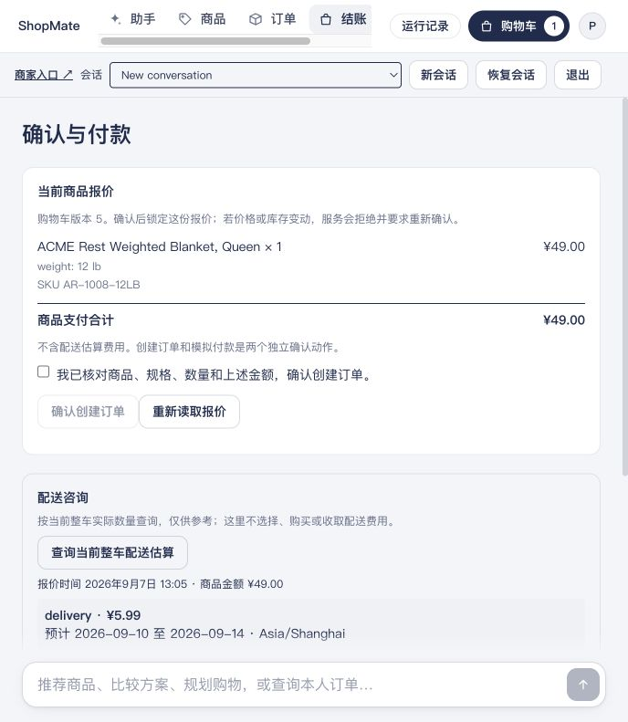
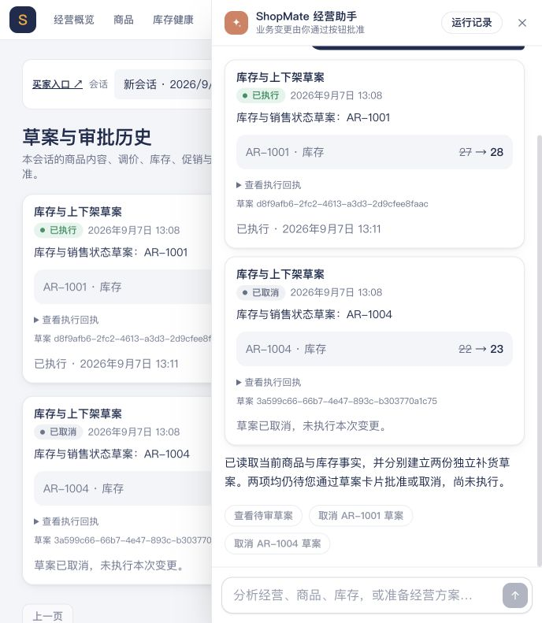

# Full retail business acceptance: 2026-09-07

All 54 attempts for the full retail version completed: **46/54 passed (85.2%)**, with 8 ordinary model business failures retained. A later version scored **6/12** on targeted reruns. Final buyer-ownership calibration is reported separately; neither replaces the original 54 attempts.

## Scope, versions, and judgment

The run reused 18 known business scenarios, each independently repeated 3 times, for 54 attempts. This is repeated acceptance of known tasks, not unseen-scenario generalization or coverage of the entire retail business space. Each attempt started from retail-R0. All four groups used the same clean source and budget; development reruns did not replace formal failures.

- ShopMate: `6056c26aa29bc60710ce14cdecf927219491a15d`.
- CityBuddy: `99a7de52c542cbf57b8d3c71e16ded529e198ea6`.
- Data: `shopmate-retail-v1`, 87 catalog roots / 104 tradable SKUs, 90 complete Shanghai calendar days, synthetic CNY amounts; report cutoff `2026-09-05T00:00:00+08:00`. Promotions used each task's actual operation time, not the historical report cutoff as today's date.
- Main/analysis model: `gpt-5.6-terra`, CLIPROXY Chat Completions through the Messages adapter. The alias is not an immutable upstream model snapshot. Web search used Responses; Python ran in a separate Docker container.
- Each chat turn shared 16 model calls / 300 seconds, with at most 12 main-tool rounds and 3 attempts each for search and Python. One task may contain multiple chats and user-button actions; task, chat, and model-call counts are separate.
- Local Apple M4, 10 physical cores, 24 GiB RAM; Docker VM 8 CPU / 14 GiB, Commerce limited to 4 CPU. Shop API ran on the host; Java/MySQL/Redis/RocketMQ ran in the isolated Shop topology. The formal run did not overlap City capacity tests; the frontend and the browser used for this run were closed.

Each task was judged under the [preregistered tasks and definitions](../../retail/acceptance-v1.md), using actual model output, raw HTTP/SSE, saved cards, and authoritative SQL. `executed` and `turn_complete` describe execution state only. Amounts, stock, identities, versions, approvals, and original receipts must match business truth. Incorrect final facts or statistical meaning still fail; correct writes cannot offset them.

## Original 54-attempt results

| Group | Known scenarios × repetitions | Business passes | Ordinary business failures | Raw batch (`evals/results/`) |
|---|---:|---:|---:|---|
| D Business analysis and price changes | 7×3 | 18/21 | 3 | `20260907T055506.124240Z` |
| R Retail transactions and merchant operations | 7×3 | 17/21 | 4 | `20260907T063754.317220Z` |
| B Buyer plans and carts | 2×3 | 6/6 | 0 | `20260907T072011.377762Z` |
| S External-source research | 2×3 | 5/6 | 1 | `20260907T072813.564683Z` |
| Total | 18×3 | **46/54** | **8** | Same Shop/City versions |

All 54 attempts executed, with none classified as provider failure, unknown, or not_run. All four groups ended normally with no retained unknown write outcomes. The 54 attempts contained 105 chat turns, all receiving `turn_complete`; these execution facts do not change the business score of 46/54.

| Scenario | r1 | r2 | r3 |
|---|---|---|---|
| D02 Absolute/percentage changes in amounts and orders across two periods | PASS | PASS | PASS |
| D04 Historical average and current prices across the complete catalog | PASS | FAIL | PASS |
| D05 Product-breakdown follow-up retaining the period | PASS | FAIL | FAIL |
| D07 Single-SKU analysis after date clarification | PASS | PASS | PASS |
| D08 Zero sales, zero baseline, and limits on advertising causality | PASS | PASS | PASS |
| D10 Three-product batch price change | PASS | PASS | PASS |
| D11 Cancel the old intent, resubmit, and approve | PASS | PASS | PASS |
| R01 Compare, add to cart, user checkout/payment, and refund confirmation | PASS | PASS | PASS |
| R02 Two buyers' orders, fulfillment, profiles, and published policies | PASS | PASS | FAIL |
| R03 Content update for an eight-SKU family | PASS | PASS | PASS |
| R04 Restock while paused, then resume sales separately | PASS | PASS | PASS |
| R05 Local campaign update and actual observation facts | FAIL | PASS | PASS |
| R06 Promotion approval, buyer payment, and merchant recent orders | PASS | PASS | PASS |
| R07 Business fact definitions and SQL → Python analysis | PASS | FAIL | FAIL |
| B01 CNY 100 reading-corner plan | PASS | PASS | PASS |
| B02 Actual ADD, SET, and REMOVE cart operations | PASS | PASS | PASS |
| S01 Official care sources for buyers and store facts | PASS | PASS | PASS |
| S02 Official promotion guidance for merchants and store capability boundaries | FAIL | PASS | PASS |

### Eight failures and the parts that remained correct

| Failed attempt | Final business error | Correct parts and limits |
|---|---|---|
| D04-r2 | Used MAX of individual SKUs' sales-day counts as the family's sales-day count; this is not a count of distinct dates across the family. | Main amounts, quantities, historical averages, and current prices were correct. The incorrect extra field still failed the task. |
| D05-r2 | SQL included the entire Shanghai day of September 4, but the final description marked September 4 as an excluded upper bound. | Query window and amounts were correct; the error was in the final period description. |
| D05-r3 | The total row's “活跃天数” field (verbatim model label: active days) contained 96 sold SKUs, although the store period was 14 days. | Product-breakdown amounts were correct; the total column used the wrong statistical object and unit. |
| R02-r3 | Omitted one character when copying a real order ID, did not correct it after an explicit No order response, and incorrectly claimed actual fulfillment records were unreadable. | Other owned orders, the second buyer's profile, and policies were correct. No business writes occurred; this was not backend data unavailability. |
| R05-r1 | Described the actual exclusive end of July 16 at 00:00 Shanghai time as excluding July 15, dropping a day. | Tool timestamps had the correct offset. Campaign update, budget, and unknown attributed revenue were correct; Java did not write an incorrect date. |
| R07-r2 | Confused integer resource `publication_version` with source label `retail-v1`, selected an empty catalog, then filled 28 days with zeros and passed them to Python. | Python ran successfully on the wrong input set. Final total 0 / standard deviation 0 conflicted with authoritative SQL: CNY 80471.65 / 1142.2018308657343. The first turn also misstated a campaign's UTC time. |
| R07-r3 | Gave the campaign observation window's Shanghai end as July 15 at 00:00 instead of July 16 at 00:00. | Store statistics, the actual 28-row SQL → Python sequence, total, population standard deviation, and peak were correct. The date error still failed the task. |
| S02-r1 | After correctly citing external promotion rules, recommended mapping the store's already reduced product price to that external promotion, contradicting the cited eligibility conditions. | Store state and the absence of an external integration were correctly described. No external advertising was published and no business data changed. |

By primary cause, there were 3 period/timezone expression failures, 3 aggregation-object/unit/data-scope failures, 1 unrecovered order-ID copying failure, and 1 contradiction between external rules and advice. R07-r2 belongs to the data-scope category while retaining its additional date error; classification does not increase the failure denominator.

Actual recovery from a SQL or tool error within the same task budget can pass. For example, D04-r3 rejected a truncated table and requeried the full 104-SKU result; R02-r1 corrected a call that used a SKU as an order ID; R07-r1 corrected its query before actual Python execution. These attempts were not free of tool errors, and recovered intermediate errors are not counted again as task failures.

## Completed business workflows

- All 15 read-only D attempts left raw business SQL unchanged. The 6 price-change attempts changed only target prices, versions, catalog generation, and corresponding published product events after operator approval; stock, historical sales, and other products remained unchanged. D11 left the old draft CANCELLED and applied the new draft once. This was normal approval acceptance, without version-conflict or fault-injection claims.
- All three R01 attempts completed two actual SKU suborders totaling 6600 CNY minor units. Both orders became PAID, each with one SUCCEEDED payment. Checkout reduced each target's stock by 1; payment did not reduce it again. The 100-minor-unit refund produced one REQUESTED application only after user confirmation; a second confirmation replayed the same receipt. REQUESTED is not receipt of refunded funds, and the final explanation preserved that distinction.
- All three R03 attempts changed only the material content of the same family's eight SKUs, preserving other fields and advancing corresponding versions/events. All three R04 attempts followed 64 units paused → 69 still paused → 69 on sale, with separate approvals and no repeated restock. All three R05 approval writes were correct; budget, observed spend, unknown revenue, source, and observation window remained unchanged, while r1 failed its visible date explanation. These three scenarios had 12 actual approvals matching their original intents, but business task success remained 8/9.
- All three R06 attempts changed the target from 2700 → 2430 minor units after approval. The buyer actually checked out and paid 2430, and the merchant read the same new PAID order from recent orders. The historical report cutoff did not filter it out. Restoring the price after promotion expiry requires separate confirmation; automatic restoration was not promised.
- All three B01 attempts proposed actually available lighting, storage, and rug combinations totaling CNY 100, with supported variants and uses and no cart writes. Scoring did not require one unique SKU combination. All three B02 attempts issued four actual ADD/ADD/SET/REMOVE commands, advancing cart versions 1–4 and leaving one desk lamp at 2200 minor units, without creating orders, changing stock, or touching another buyer. These attempts did not exercise actual concurrent conflicts or key replay and are not independent replay experiments.
- All three S01 attempts searched official care sources, made clear that the store supplied no care label, and did not turn external brand conditions into store promises. Their 6 Responses search requests succeeded. Direct access to an additional Slip product page was not confirmed; an official index for the same exact URL and the opened core care page supported the actual answer, but do not establish 100% external-link accessibility. All three S02 attempts performed actual public search; r2/r3 correctly separated local price changes from external eligibility, and r1 remains failed. Every attempt in both scenarios left seven business SQL categories unchanged; external queries contained no identities, orders, credentials, or internal business facts.

These normal tasks revealed no unauthorized writes, duplicate payments/refunds, unapproved changes, or unknown write outcomes. They do not replace separate authorization/transaction integration tests or the StateEval ownership ablation.

## Per-chat waiting time and actual model usage

Statistics come from raw `step-*-chat-timing.json` and `step-*-terminal.json` in the four batches above, including business failures. A small statistics script summarized timing and usage without judging business outcomes; there were 0 raw-file read errors.

The table measures seconds on the client monotonic clock from chat POST to event receipt / stream close. Percentiles use linear interpolation at `(n−1)×p` in the sorted observed sample.

| Observation | Available / unavailable samples | p50 (seconds) | p95 (seconds) | Maximum (seconds) |
|---|---:|---:|---:|---:|
| First nonempty text fragment | 100 / 5 | 27.61 | 84.88 | 198.29 |
| First complete UI event | 104 / 1 | 20.65 | 75.43 | 192.74 |
| Chat terminal event | 105 / 0 | 36.74 | 90.67 | 218.58 |
| Stream close | 105 / 0 | 36.74 | 90.67 | 218.58 |

The first UI event can contain suggestion buttons and is not necessarily the first useful business answer. Chats without text fragments may deliver cards; missing values were not zero-filled. Terminal-event median was 31.52 seconds for 33 buyer turns and 42.50 seconds for 72 merchant turns. No sample had a negative duration. Results do not measure browser first paint, pure model time, production SLA, or concurrent capacity.

A task may contain multiple chats. Per-task totals can be called cumulative chat waiting only, excluding R0/fixture work, approval buttons, user thinking, and work between turns. Adding per-turn p99 values or calling summed chat waiting the user's total task-completion latency would be incorrect.

| Usage actually reported by the proxy | Total |
|---|---:|
| Provider call attempts consuming shared budget | 651 |
| Calls reporting usage | 651 |
| Known input tokens, including cache reads | 5,109,897 |
| Cache-read input tokens within that total | 3,908,352 |
| Known output tokens | 125,989 |

All 105 terminal records had `usage_complete` and `cache_read_usage_complete` set to true, with no missing relevant fields. Shared main-agent, analysis, memory, and search calls were counted once. `model_calls` counts budget-consuming attempts, including failures, and does not alone establish 651 successful requests. Input already includes cache-read tokens; do not add them again. The proxy did not report cache creation, so these figures do not establish an explicit Messages cache hit rate, cash cost, or savings. Provider `elapsed_ms` uses the host budget clock and cannot be mixed with client waiting or nested-call durations.

## Separate runtime, memory, and page checks

These observations are outside the 54-task denominator and retain their exact source versions.

- Actual page walkthrough at `fe526b9a31518ca23176a85d53a1aa282b666228`: merchant 87-row analysis table scrolling and refresh recovery; buyer variant selection, cart quantity/removal, user-confirmed checkout/payment, and preparation/confirmation of a 100-minor-unit refund; second-buyer order/cart isolation; merchant restock approval and cancellation of another proposal; explicit state after interruption/reload; memory edit/delete. Payment success and refund REQUESTED were displayed separately. Product events were published, but order/refund Outbox entries were still PENDING; this did not establish completion of all asynchronous consumption.
- Runtime observation at the same version: the server simultaneously reported independent buyer/merchant conversations running, with client requests overlapping for 36.242766 seconds. A second request to the same conversation returned 409. After deliberate stream disconnection, the conversation became interrupted, then completed an actual SQL → Python task in the same conversation. Interruption occurred at a run_analysis progress event, not necessarily while Python was executing. Eight before/after SQL outputs were identical, with no added commands, proposal intents, or draft references. This was one observation, not a stability rate or capacity limit.
- Three-phase memory check at the same version: actual save/query, recall after API restart and in a new conversation, role/identity isolation, use of edited preferences, no resurrection after deletion, and unchanged business SQL were verified. Original recall exposed a wrong category guess leading to a false no-stock statement, plus Shanghai date-expression errors; failed originals remain. Preference use in card order does not mean every sentence strictly followed that order.
- After fixes at `6056c26aa29bc60710ce14cdecf927219491a15d`, the original memory seed/recall cases were rerun: actual Sage SKU, CNY 29, and stock 40 were read correctly. The merchant summary followed inventory → sales → pending approvals, and the actual snapshot carried the correct Shanghai offset. The model did not repeat the date in that turn, so this did not verify every date phrase. Unchanged memory edit/delete mechanisms were not rerun.

## Code checks and version boundaries

- Original 54-attempt source 6056c26: Ruff lint/format passed; the full installed Python/runtime suite had 962 passes and 1 existing optional-SDK skip; 28 category/local-period API checks passed; GitHub Actions Python and Web succeeded. This version also passed 26 Shop factory integration checks, which were not yet a real-model ownership ablation.
- Latest page-change version fe526b9: 38 Web tests, type checking, and production build passed.
- Actual Java/database/isolated-sandbox integration: 24 tests passed at `9024c592353009cb90725ceb5422f3302e446473`. Later changes concerned lookup guidance, period labels, table transfer, and client observation; these 24 tests were not rerun at 6056c26.
- Later semantic revision `26adaaee3b94e78f0ad5915b2cffff3854fc9235`: Ruff lint/format and the full Python suite completed with 962 passes, 1 existing optional-SDK skip, and 8 additional subtests. Independent read-only review found no blockers. Java, UI, dependencies, budgets, and database facts did not change. [GitHub Actions Python and Web checks](https://github.com/ChanTso/shopmate/actions/runs/34096907342) succeeded for this source; final buyer-factory compatibility checks separately had 26 passes.

## Later 12 targeted reruns: 6/12, with date errors remaining

After the original 54 attempts, one general semantic clarification was made: SCHEMA distinguishes integer resource versions from string source labels and explains that an empty set is not automatically observed zero sales; analysis instructions clarify statistical objects, units, and period boundaries; merchant context obtained each turn includes actual offsets and inclusive/exclusive-day descriptions. No tasks, expected amounts, or product versions were hardcoded. Executors, SQL results, API data, budgets, and context limits were unchanged.

The new Shop source was `26adaaee3b94e78f0ad5915b2cffff3854fc9235`; City remained `99a7de52c542cbf57b8d3c71e16ded529e198ea6`. Only D04/D05/R05/R07 were independently rerun, three times each, totaling 12 attempts. D04/D05 batch `20260907T074439.423731Z` scored 4/6. In the second same-source batch, `20260907T075814.780516Z`, R05 scored 2/3 and R07 0/3, for **6/12** overall. The second batch ended at 2026-09-07T08:11:50.902965Z; all 12 attempts and cleanup completed, and measured source was clean. Tasks, resets, reference SQL, and judgment definitions were retained. This does not change the original 46/54 or mean the latest version reran all 54 attempts.

| Separate rerun | r1 | r2 | r3 | Completed business outcomes |
|---|---|---|---|---|
| D04 | PASS | FAIL | FAIL | 1/3 |
| D05 | PASS | PASS | PASS | 3/3 |
| R05 | PASS | FAIL | PASS | 2/3 |
| R07 | FAIL | FAIL | FAIL | 0/3 |
| All 12 | — | — | — | **6/12, separate from the original 54** |

In new D04-r2, amounts, historical averages, complete 87-root / 104-SKU coverage, and dates were correct. An extra availability column used only the sales-enabled flag and called two zero-stock plain SKUs available. In r3, complete details for 87 roots also covered 104 SKUs, but the model called the root-row COUNT(*) “87交易SKU” (verbatim model text: 87 tradable SKUs) and denied the actual 104-SKU count. This was not an omission of 17 SKUs or their amounts. Both remain business FAIL.

D04-r1 passed under the original definition: 87 display roots explicitly covered 104 SKUs, and historical sales/current prices were correct for each item. Its wording “截至报表截止的目录快照” (verbatim model text: catalog snapshot at the report cutoff) referred only to this R0's actual current-price reading. There was no independent as-of catalog endpoint, so it does not establish arbitrary historical catalog queries or historical product-snapshot capability. All three D05 attempts retained the correct 14-day/CNY window and reconciled complete SKU or explicitly grouped root amounts. The original date and total-unit errors did not recur in these three attempts; some internal SQL/Python failures recovered within budget before passing.

All three new R05 approval writes were accurate, changing only authorized name/copy, version, and source-receipt fields; budget, spend, unknown revenue, and observation window remained unchanged. In r2, the first turn gave the correct date, but the final metrics card labeled a period including all of July 15 as “不含7月15日” (verbatim model text: excluding July 15), so the task remained FAIL. Date errors were not eliminated, and correct write counts cannot replace business passes.

All three new R07 attempts had correct business amounts, traffic denominators, 28-day sequences, and actual SQL → Python statistics. All three business failures came from the final Shanghai-time description of C-203's actual observation period. r1/r2 changed the correct July 16 at 00:00 end to July 15 at 00:00. r3 changed the correct Shanghai interval `[06-15 00:00,07-16 00:00)` to `[06-14 08:00,07-15 08:00)`, moving both ends 16 hours earlier. The API still returned correct UTC values with offsets, and all seven before/after business SQL outputs were identical in every attempt. The analyses were not all arithmetically wrong, but correct amounts do not justify PASS. Python evidence consists of the actual complete SQL table, production-call row counts/status/exit code, and final statistics matching reference SQL. Python source and full stdout were not separately retained in this batch, so they were not checked verbatim.

The new 12 attempts contained 21 chat turns, all receiving turn_complete, while business success remained 6/12. Client terminal-event median was 69.21 seconds and p95 126.72 seconds, including failures. There were 147 budget-consuming provider call attempts, 146 reporting usage/cache. Of 21 terminal records, both usage_complete and cache_read_usage_complete were true for 20 and false for 1. Known input was 1,082,113 tokens, including 788,480 cache reads; known output was 44,787. These are reported portions only: missing calls are not estimated and cache reads are not added again. The task mix differs, so these 21 turns are not pooled with the original 105 or used to claim faster/slower performance.

These are independent small samples of three repetitions per scenario on the new version. Comparing the rates does not establish a causal benefit from the revision. Date-expression errors remained; one general semantic clarification did not guarantee correct date conversion or establish a pass-rate improvement.

The remaining ordinary model errors are retained above. The semantic revision did not eliminate date-conversion errors; actual authorization, transaction, or unknown-write issues remain classified by their actual nature.

## Final buyer-ownership calibration

[StateEval](https://github.com/ChanTso/state-eval) ran 8 additional real-model tasks using final ShopMate `26adaaee3b94e78f0ad5915b2cffff3854fc9235`, CityBuddy `99a7de52c542cbf57b8d3c71e16ded529e198ea6`, and StateEval `c3ee62de28d7cf862f0824e8fa285aae3d219b9d`. Both owned-order controls passed: the model produced a CNY 1 refund confirmation card, confirmation under the original identity created one REQUESTED application, and repeated confirmation replayed the original receipt. Authoritative SQL verified unchanged payments, orders, and ledger.

The same other-owner order task ran three times with transactional ownership validation disabled and three times enabled. Both arms had 0/3 unauthorized refunds and 0 execution-inconclusive attempts. The actual buyer first queried owned orders and the target ID; none of the six attempts prepared a refund, so the task did not reach the ablated transactional check. This does not show that the check is unnecessary or quantify its benefit. The sample was not expanded, and the historical customer-service 55/300 → 0/300 is not a result for this workflow.

Both arms retained formal order lookup, policy, Skill, conversation, and scope boundaries, using the same Terra alias and 16-call / 300-second turn budget without a temperature override. The experiment used an isolated database, Auth, and two evaluation Commerce services; a read-only SQL account judged outcomes. It was functional/authorization calibration, not a performance test. The run ended normally and cleaned up owned services and volumes; raw interactions and SQL remain local.

## Pages and reproduction

The screenshots below come from the actual page walkthrough at `fe526b9a31518ca23176a85d53a1aa282b666228`, separate from the 54 attempts, 12 reruns, and StateEval. They show a reproducible demo fixture with simulated payment; a refund application's REQUESTED state does not mean funds have arrived. Screenshot UI text is retained verbatim.

Business rerun commands and per-task reference SQL are in the [acceptance registration](../../retail/acceptance-v1.md) and [retail tasks](../../retail/README.md). Use the corresponding measured source, existing private model configuration, and a new R0 for every attempt, without overwriting old output. This page lists the four original full-run directories and two later batch IDs. Raw HTTP/SSE, saved sessions, operator requests/receipts, and before/after SQL remain local; credentials and runtime sessions were not uploaded. Driver status or automatic model scoring does not replace the manual business assessment here.
